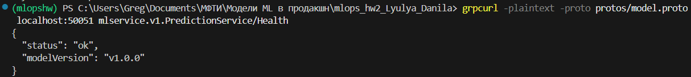
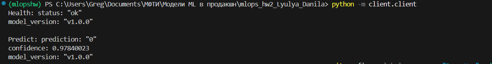
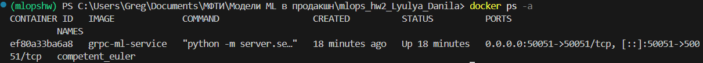

## ML gRPC Service <br>
Минимальный ML-сервис с gRPC интерфейсом, упакованный в Docker контейнер.

## Описание проекта <br>
Сервис предоставляет два gRPC эндпоинта: <br>

/health - проверка здоровья сервиса <br>

/predict - получение предсказаний ML-модели <br>

Сервис предназначен для демонстрации полного цикла развертывания ML-модели в продакшн окружении с использованием gRPC и Docker. <br>

## Архитектура 

Client (gRPC) → Docker Container → gRPC Server → ML Model → Response <br>

## Команды сборки и запуска

1. Сборка Docker <br>
    
  ``` docker build -t grpc-ml-service .``` 
2. Запуск контейнера <br>
    
  ``` docker run -p 50051:50051 grpc-ml-service```

## Проверка работы контейнера
   
  ``` docker ps -a```

    
    
## Примеры вызовов /health и /predict

### /health
    Для проверки в терминале:

  ``` grpcurl -plaintext -proto protos/model.proto localhost:50051 mlservice.v1.PredictionService/Health```
    
    Полученный ответ: <br>
        

### /predict
    Запустите в терминале: <br>
    
   ``` python -m client.client```
    
    Полученный ответ: <br>
    